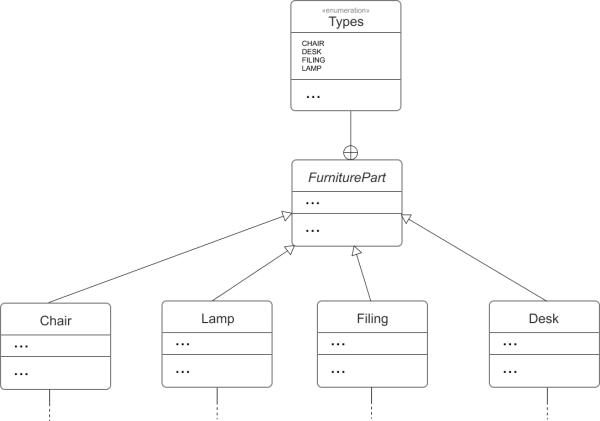
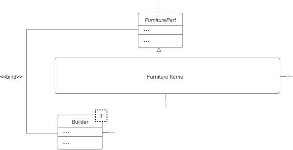
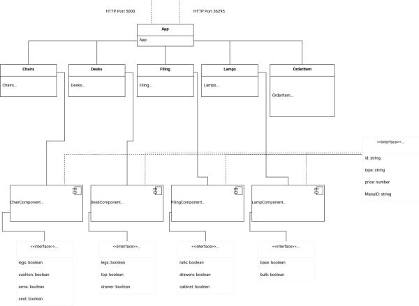

# UML Diagram and Software Architecture

### Backend UML Diagram

### Frontend UML Diagram

---

### Overview

The Reinventorii software architecture takes a modular design approach to store furniture items, display a catalogue of furniture types and even utilizes an algorithm to determine combinations of furniture items with the cheapest cost. To achieve this, dynamic class relationships are utilized to create a modular, efficient, and sustainable program to solve the given problem while considering future implementations of this code.

#### Important relationships

_Child-Parent Relationship using the inheritance property through FurniturePart – Desk, Lamp, Filing & Chair. Containment relationship with FurniturePart and an enum (includes all possible furniture types)._

_`<<Bind>>` stereotype for the upper-bounded generic in the Builder Class. Utilizes the implements key word to suggest only children of FurniturePart are accepted types._

#### End-To-End Integration

The use of the RESTManager class creates the connection between the React front-end and the Java back-end. This is seen when users request items through the React Class ItemOrder and relevant information is sent to the Java Builder class (algorithm) to calculate combinations, cost and potential manufacturers.

#### MySQL Database

The Database class sends queries to inventory.sql to collect information regarding each furniture item. This is then stored in our program and respectively sent to the RESTManager to display on the front-end. Database is the only class which can send queries to MySQL, and hence, the RESTManager relays Algorithm results back to the Database class when possible. For example, when an item is removed after a successful order.

